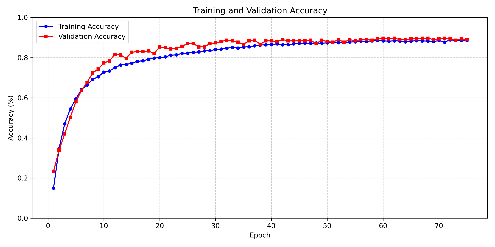
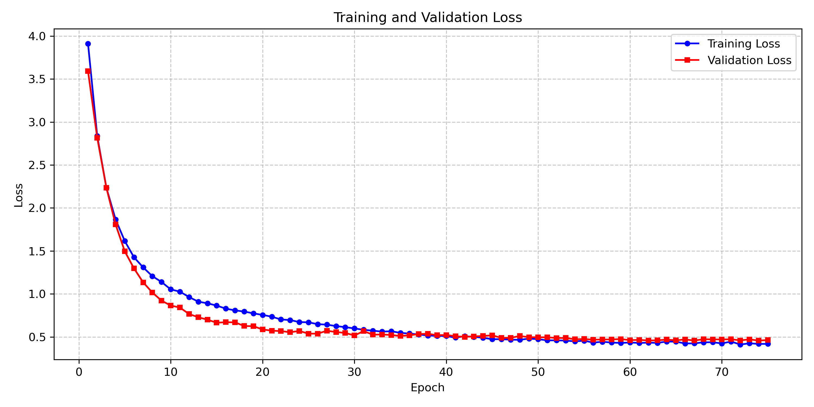
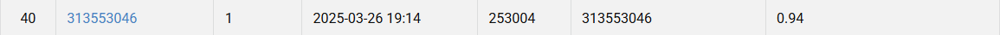

# Visual-Recognition-using-Deep-Learning-HW1

## StudentID: 313553046
## Name: 馬國維

## Introduction
In this assignment, there is an image classification task, which needs to classify images into 100 classes. For this task, I utilize transfer learning with a pre-trained weight and use resnet50 model as base model, and modify the model architecture to improve the performance in the task.

## How to install
git clone https://github.com/seeadragon/Visual-Recognition-using-Deep-Learning-HW1

## Requirements
Python                    3.9.21
pytorch-cuda              11.8
torchvision               0.20.1

## Dataset Structure
data/
├── train/
│   ├── class_0/
│   │   ├── img_0.jpg
│   │   ├── img_1.jpg
│   │   └── ...
│   ├── class_1/
│   └── ...
├── val/
│   ├── class_0/
│   ├── class_1/
│   └── ...
└── test/
    ├── img_0.jpg
    ├── img_1.jpg
    └── ...

## Usage
### For training
python main.py 
### For evaluating
python evaluate.py

## Hyperparameters
Batch Size: 64
Learning Rate: 1e-4 (FC layers), 3e-5 (other layers)
Weight Decay: 5e-5
Optimizer: AdamW
Scheduler: ReduceLROnPlateau (factor=0.7, patience=3)

## Hardware Specifications
CPU: 12th Gen Intel(R) Core(TM) i5-12400F
GPU: NVIDIA GeForce RTX 3050

## Results
train acc=0.889
val acc=0.897
leaderboard prediction score=0.94

